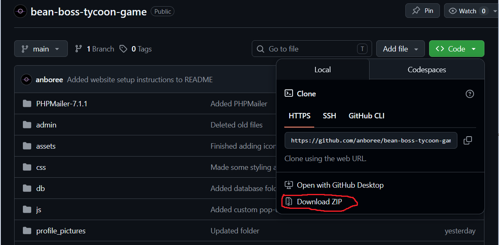
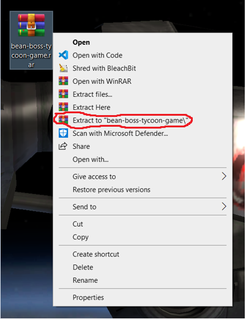
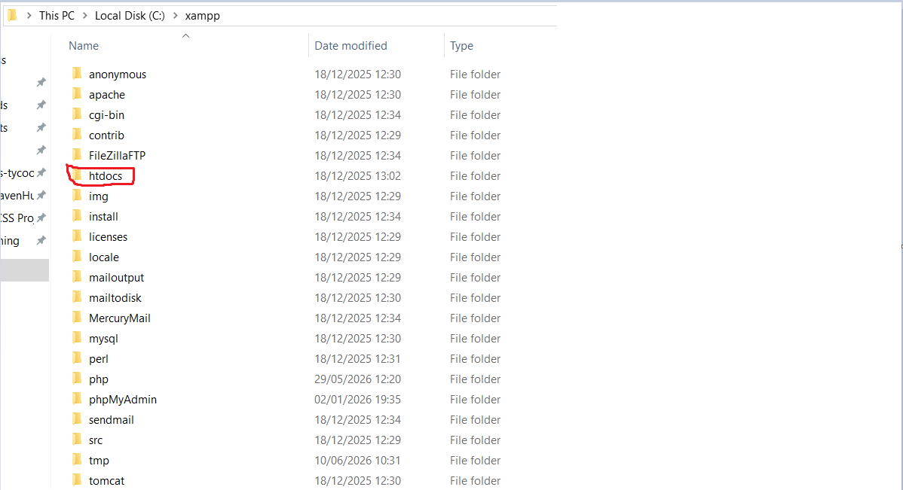
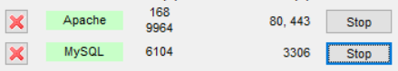
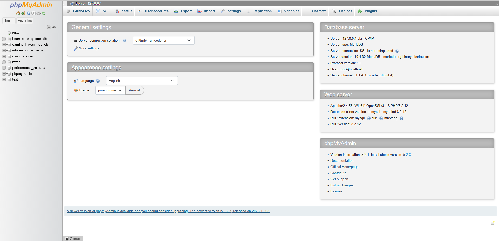
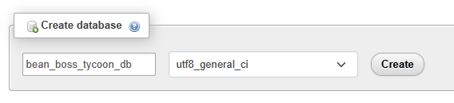
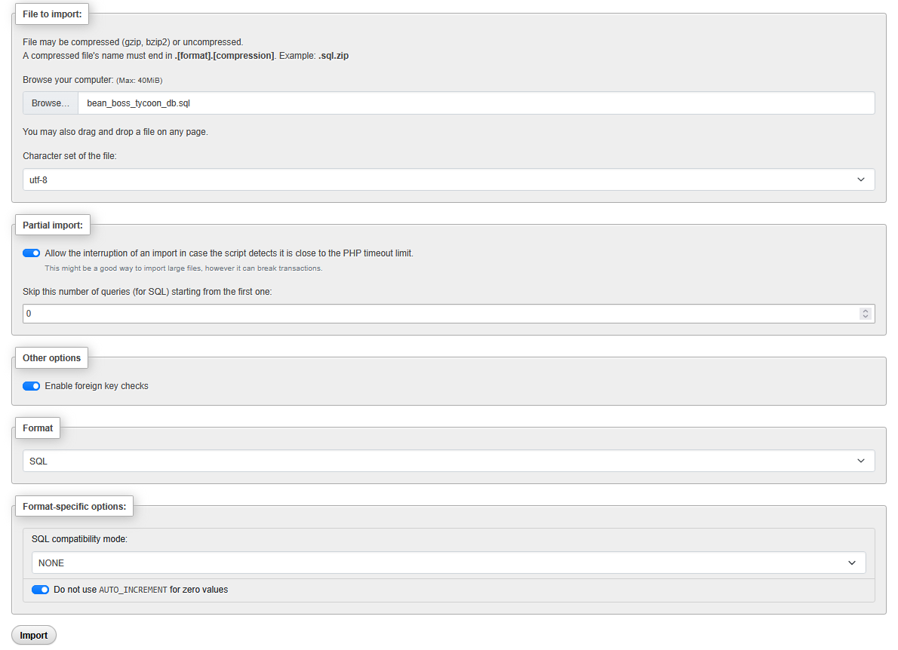

# WEBSITE SETUP

**1.** Download project as zip\
\
\
\
**2.** Extract zip folder\
\
\
\
**3.** Place extracted folder inside XAMPP's htdocs folder\
\
\
\
**4.** Open XAMPP\
**5.** Start Apache and MySQL servers\
\
\
\
**6.** Open localhost/phpmyadmin in web browser\
\
\
\
**7.** Create database named - bean_boss_tycoon_game\
**8.** Set collation to utf8_general_ci\
**9.** Press 'Create' button\
\
\
\
**10.** Press 'Import' in the top navbar\
**11.** Press 'Browse' and select the bean_boss_tycoon_game.sql file from the extracted project folder\
**12.** Press 'Import'\
\
\
\
**13.** Database is set up!\
\
**14.** Type localhost/bean-boss-tycoon-game/ in your web browser, adjust if you have put it in another folder inside htdocs\
**15.** Website should be open and fully working!
